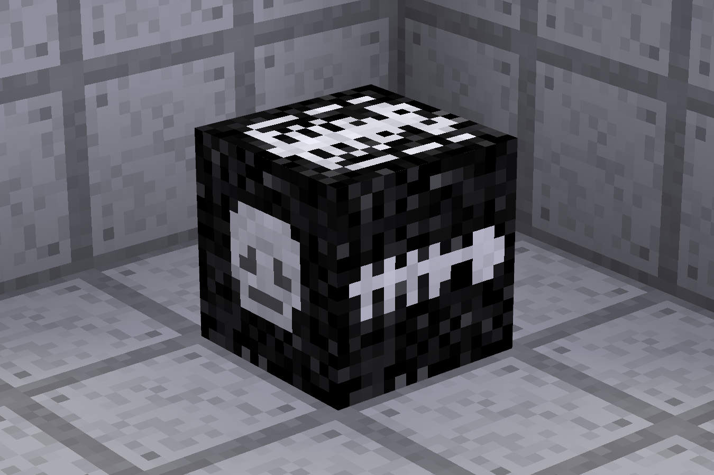

# Bones Redo [bones]

A redo of the bones mod from Minetest Game.

## Improvements from MTG

- **Dynamically sized inventory** - To fit ALL your items.
- **Inventory restoration** - Items return to the original places when collecting bones.
- **Better bone generation** - Always finds somewhere to place bones, 98% guaranteed.
- **No lost items** - Bones have multiple fallback modes and if they all fail you keep your items.
- **Bone pickup** - Bones can be picked up with items inside using sneak+punch.
- **Waypoints** - Bones are marked by a waypoint for a configurable amount of time.
- **Game independent** - Doesn't depend on the `default` mod.
- **New textures** - More detailed and... better.
- **Custom sounds** - Because bones are not made of gravel.

## Dependencies

**Optional**

- [`3d_armor`](https://github.com/minetest-mods/3d_armor)

## Installation

Download the [master branch](https://github.com/OgelGames/bones/archive/master.zip) or the [latest release](https://github.com/OgelGames/bones/releases), and follow [the usual installation steps](https://wiki.minetest.net/Installing_Mods).

## License

Except for any exceptions stated in [LICENSE.md](LICENSE.md#exceptions), all code is licensed under the [MIT License](LICENSE.md#mit-license), with all textures, models, sounds, and other media licensed under the [CC BY-SA 4.0 License](LICENSE.md#cc-by-sa-40-license).
